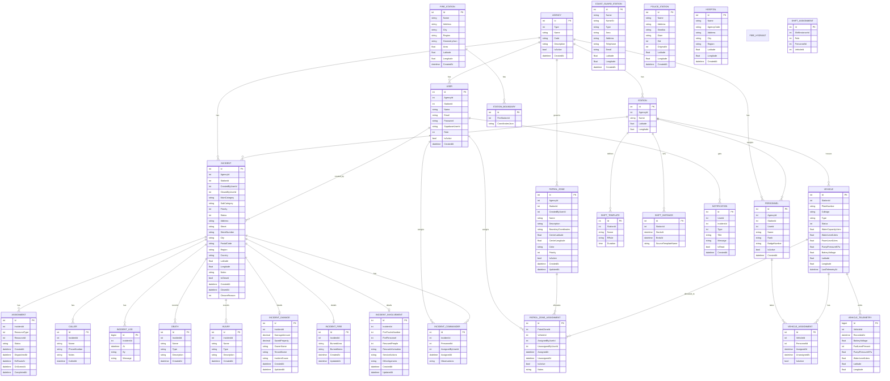

# Incident Management System — Database ER Diagram (Mermaid)

This file contains the Mermaid ER diagram for the current DB Scheme.

```mermaid
erDiagram
  AGENCY ||--o{ USER : has
  AGENCY ||--o{ STATION : has
  AGENCY ||--o{ INCIDENT : has
  AGENCY ||--o{ PERSONNEL : has
  AGENCY ||--o{ PATROL_ZONE : governs

  STATION ||--o{ VEHICLE : houses
  STATION ||--o{ PERSONNEL : assigns
  STATION ||--o{ SHIFT_TEMPLATE : defines
  STATION ||--o{ SHIFT_INSTANCE : runs
  STATION ||--o{ INCIDENT : receives
  USER ||--o{ NOTIFICATION : gets

  INCIDENT ||--o{ ASSIGNMENT : has
  INCIDENT ||--o{ CALLER : has
  INCIDENT ||--o{ INCIDENT_LOG : has
  INCIDENT ||--o{ DEATH : records
  INCIDENT ||--o{ INJURY : records
  INCIDENT ||--o| INCIDENT_DAMAGE : details
  INCIDENT ||--o| INCIDENT_FIRE : details
  INCIDENT ||--o| INCIDENT_INVOLVEMENT : details
  USER ||--o{ INCIDENT : created_by
  USER ||--o{ INCIDENT_COMMANDER : assigns
  USER ||--o{ PATROL_ZONE_ASSIGNMENT : assigns

  PERSONNEL ||--o{ VEHICLE_ASSIGNMENT : takes
  VEHICLE ||--o{ VEHICLE_ASSIGNMENT : has
  VEHICLE ||--o{ VEHICLE_TELEMETRY : emits
  INCIDENT ||--o{ INCIDENT_COMMANDER : has

  PATROL_ZONE ||--o{ PATROL_ZONE_ASSIGNMENT : allocates
  VEHICLE ||--o{ PATROL_ZONE_ASSIGNMENT : allocated_to

  FIRE_STATION ||--o{ STATION_BOUNDARY : has

  %% Standalone reference datasets (no FKs out)
  COAST_GUARD_STATION
  POLICE_STATION
  HOSPITAL
  FIRE_HYDRANT

  AGENCY {
    int Id PK
    int Type
    string Name
    string Code
    string Description
    bool IsActive
    datetime CreatedAt
  }

  USER {
    int Id PK
    int AgencyId
    int StationId
    string Name
    string Email
    string Password
    string SupabaseUserId
    int Role
    bool IsActive
    datetime CreatedAt
  }

  STATION {
    int Id PK
    int AgencyId
    string Name
    float Latitude
    float Longitude
  }

  INCIDENT {
    int Id PK
    int AgencyId
    int StationId
    int CreatedByUserId
    int ClosedByUserId
    string MainCategory
    string SubCategory
    int Priority
    int Status
    string Address
    string Street
    string StreetNumber
    string City
    string PostalCode
    string Region
    string Country
    float Latitude
    float Longitude
    string Notes
    bool IsClosed
    datetime CreatedAt
    datetime ClosedAt
    int ClosureReason
  }

  ASSIGNMENT {
    int Id PK
    int IncidentId
    int ResourceType
    int ResourceId
    string Status
    datetime CreatedAt
    datetime DispatchedAt
    datetime EnRouteAt
    datetime OnSceneAt
    datetime CompletedAt
  }

  CALLER {
    int Id PK
    int IncidentId
    string Name
    string PhoneNumber
    string Notes
    datetime CalledAt
  }

  INCIDENT_LOG {
    bigint Id PK
    int IncidentId
    datetime At
    string By
    string Message
  }

  INCIDENT_DAMAGE {
    int Id PK
    int IncidentId
    decimal DamageAmount
    decimal SavedProperty
    string OwnerName
    string TenantName
    string IncidentCause
    datetime CreatedAt
    datetime UpdatedAt
  }

  INCIDENT_FIRE {
    int Id PK
    int IncidentId
    string BurnedArea
    string BurnedItems
    datetime CreatedAt
    datetime UpdatedAt
  }

  INCIDENT_INVOLVEMENT {
    int Id PK
    int IncidentId
    int FireTrucksNumber
    int FirePersonnel
    int RescuedPeople
    string RescueInformation
    string ServiceActions
    string OtherAgencies
    datetime CreatedAt
    datetime UpdatedAt
  }

  DEATH {
    int Id PK
    int IncidentId
    string Name
    string Type
    string Description
    datetime CreatedAt
  }

  INJURY {
    int Id PK
    int IncidentId
    string Name
    string Type
    string Description
    datetime CreatedAt
  }

  VEHICLE {
    int Id PK
    int StationId
    string PlateNumber
    string Callsign
    string Type
    int Status
    float WaterCapacityLiters
    float WaterLevelLiters
    float FoamLevelLiters
    float PumpPressureKPa
    float BatteryVoltage
    float Latitude
    float Longitude
    datetime LastTelemetryAt
  }

  VEHICLE_TELEMETRY {
    bigint Id PK
    int VehicleId
    datetime RecordedAt
    float BatteryVoltage
    int FuelLevelPercent
    float PumpPressureKPa
    float WaterLevelLiters
    float Latitude
    float Longitude
  }

  VEHICLE_ASSIGNMENT {
    int Id PK
    int VehicleId
    int PersonnelId
    datetime AssignedAt
    datetime UnassignedAt
    bool IsActive
  }

  PERSONNEL {
    int Id PK
    int AgencyId
    int StationId
    int UserId
    string Name
    string Rank
    string BadgeNumber
    bool IsActive
    datetime CreatedAt
  }

  INCIDENT_COMMANDER {
    int Id PK
    int IncidentId
    int PersonnelId
    int AssignedByUserId
    datetime AssignedAt
    string Observations
  }

  NOTIFICATION {
    int Id PK
    int UserId
    int IncidentId
    int Type
    string Title
    string Message
    bool IsRead
    datetime CreatedAt
  }

  PATROL_ZONE {
    int Id PK
    int AgencyId
    int StationId
    int CreatedByUserId
    string Name
    string Description
    string BoundaryCoordinates
    float CenterLatitude
    float CenterLongitude
    string Color
    int Priority
    bool IsActive
    datetime CreatedAt
    datetime UpdatedAt
  }

  PATROL_ZONE_ASSIGNMENT {
    int Id PK
    int PatrolZoneId
    int VehicleId
    int AssignedByUserId
    int UnassignedByUserId
    datetime AssignedAt
    datetime UnassignedAt
    bool IsActive
    string Notes
  }

  SHIFT_TEMPLATE {
    int Id PK
    int StationId
    string Name
    string RRule
    time Duration
  }

  SHIFT_INSTANCE {
    int Id PK
    int StationId
    datetime StartsAt
    datetime EndsAt
    string SourceTemplateName
  }

  SHIFT_ASSIGNMENT {
    int Id PK
    int ShiftInstanceId
    int Role
    int PersonnelId
    int VehicleId
  }

  FIRE_STATION {
    int Id PK
    string Name
    string Address
    string City
    string Region
    string GeometryJson
    float Area
    float Latitude
    float Longitude
    datetime CreatedAt
  }

  STATION_BOUNDARY {
    int Id PK
    int FireStationId
    string CoordinatesJson
  }

  POLICE_STATION {
    int Id PK
    string Name
    string Address
    string Sinoikia
    string Diam
    int Gid
    int OriginalId
    float Latitude
    float Longitude
    datetime CreatedAt
  }

  HOSPITAL {
    int Id PK
    string Name
    string AgencyCode
    string Address
    string City
    string Region
    float Latitude
    float Longitude
    datetime CreatedAt
  }

  COAST_GUARD_STATION {
    int Id PK
    string Name
    string NameGr
    string Type
    string Area
    string Address
    string Telephone
    string Email
    float Latitude
    float Longitude
    datetime CreatedAt
  }
```
