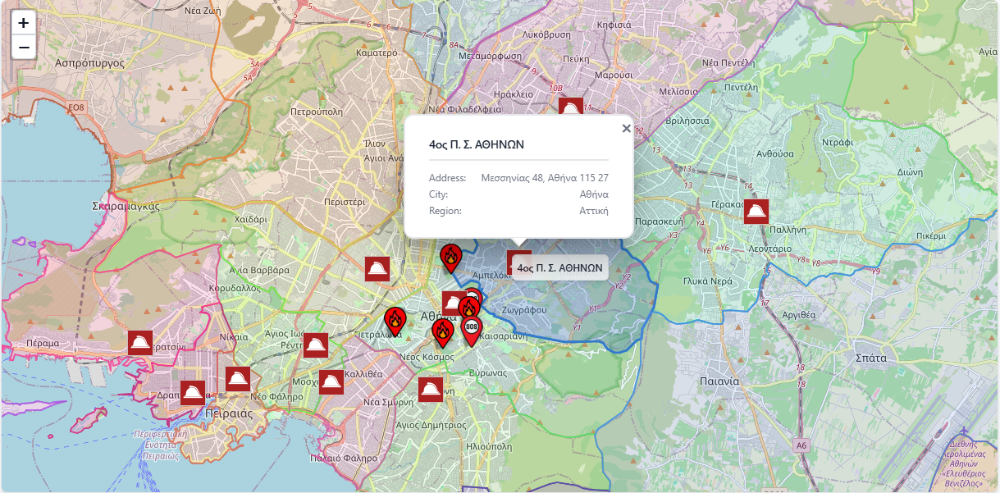

# Aegis Incident Management System

An open-source web app for coordinating public safety incidents. It keeps incident information, assignments, and maps in one place so teams can record, track, and follow up on events.

## What it is
- A way to log an incident, update its status, and close it when finished.
- A shared view for teams: location, notes, assignments, and basic timelines.
- A map-based interface with stations, patrol zones, hydrants, hospitals, and incidents.
- A role-aware UI; dispatchers and station members see the tools they need.

## What you can do
- Create and manage incidents with priorities and location details.
- Add callers and notes; keep a running log of what happened and when.
- Record incident leaders, casualties, fire details, and property damage when relevant.
- Assign vehicles and personnel; follow a simple timeline (notified → on scene → finished).
- Use the CAD view to focus on active incidents and receive real time alerts about new incidents the moment the dispatcher creates an incident.
- Browse dashboards aligned to your agency (Fire Service, Coast Guard, Police, EKAB). Each agency has unique features. For example the Coast Guard has also a maritime map with live ship traffic (VesselFinder embeded map since API costs for live trafficing are high). Police can create Patrol Zones and assign vehicles there.

## How it works (in practice)
- Incidents: list, filter, sort; open one to see details and history.
- New Incident: pick a type, set a location, the app can suggest the right station based on location.
- Vehicles and roster: view station resources and make assignments.
- Map view: layers for boundaries, zones, and nearby infrastructure.
- Real-time updates: changes appear in the UI without manual refresh.

## Roles and permissions
Access is enforced in the UI and the API.

- Dispatcher (agency-level)
  - View all incidents in the agency.
  - Create incidents; update status; close or reopen when appropriate.
  - Assign vehicles and personnel from any station in the agency.
- Station member (station-level)
  - View incidents for their station, or incidents where their station’s vehicles are assigned (For example in mutual aid scenarios).
  - Manage station roster and vehicles.
  - Access station-focused views; broader actions are limited.
  - Access to the CAD which is the main page. On that page incidents, status and everything is updated in real time (when a dispatcher makes a change).

## Reference data and imported files
The backend loads and caches reference datasets on startup to support maps and station lookups:
- Fire stations and station boundaries (GeoJSON)
- Fire hydrants (GeoJSON)
- Coast Guard stations (GeoJSON)
- Police stations (GeoJSON)
- Hospitals (GeoJSON)
- Incident type catalogs per agency (JSON)

Sources
- The geographic datasets were prepared from OpenStreetMap using the Overpass API and geodata.gov.gr. This project was developed with Hellenic Emergency Services in mind, including Fire Departments, Police, Coast Guard, and EKAB (Emergency Medical Services).
- Files are referenced in the API configuration (appsettings.json) and loaded at startup with simple retry/caching.

These imports enable features like “find station by location” when creating an incident and provide map layers for context.

## Example data formats

Incident types (per agency)
```json path=null start=null
{
  "Hellenic Fire Service": {
    "urban_fire": {
      "el": "Πυρκαγιά σε κτίριο",
      "en": "Urban fire",
      "subcategories": [
        { "el": "Διαμέρισμα", "en": "Apartment" },
        { "el": "Κατάστημα", "en": "Store" }
      ]
    },
    "wildfire": {
      "el": "Δασική πυρκαγιά",
      "en": "Wildfire",
      "subcategories": [
        { "el": "Χορτολιβαδική", "en": "Grass" }
      ]
    }
  }
}
```

GeoJSON (hydrant or point asset)
```json path=null start=null
{
  "type": "FeatureCollection",
  "features": [
    {
      "type": "Feature",
      "geometry": { "type": "Point", "coordinates": [23.7275, 37.9838] },
      "properties": {
        "external_id": "HYD-00123",
        "name": "Hydrant",
        "agency": "Hellenic Fire Service"
      }
    }
  ]
}
```

## Tech stack (brief)
- Frontend: React + TypeScript (Vite), Tailwind CSS, Leaflet
- Backend: .NET 8 Web API, Entity Framework Core (SQLite / SQL Server / PostgreSQL), SignalR, JWT auth

## Build and run
Prerequisites
- .NET 8 SDK
- Node.js 18+

API (backend)
- Quick start with SQLite (recommended for local):
  1) Open api/src/IncidentManagement.Api/appsettings.json and configure the SQL connection along with everything else you want.
     - JWT settings exist by default (a key, issuer, audience).
  2) Restore and run:
     dotnet restore
     dotnet run --project api/src/IncidentManagement.Api/IncidentManagement.Api.csproj

  On first run, the API seeds core data (agencies, users, stations, vehicles, personnel, sample incidents) and loads reference GeoJSON/JSON files.

Web (frontend)
- Start the dev server:
  1) cd web
  2) npm install
  3) npm run dev

  The dev server runs at http://127.0.0.1:5173 and proxies /api to http://localhost:5000. The SignalR client in development connects directly to http://localhost:5000.

Desktop app
- There are two desktop apps currently:
  1) One is a simple configurator which allows the user to add stations, personnel etc. This is very basic and will be improved in the future.
  2) The other is called AegisDispatcher. Its a WPF application which is can be used only by dispatchers. It has simplified features from the web page and allows quick incident creation and resource managamenet.

## Screenshots

## AegisDesktop Standalone WPF Application:


## Web App (React)





---

## Videos
- [IMS Incident LifeCycle](media/IMS_Incident_LifeCycle.mp4)
- [Patrol Zone Creation](media/Patrol%20Zone%20Creation.mp4)
- [Web Login](media/WebLogin.mp4)

## Status
Active development. Features may change. Suggestions are welcome.
